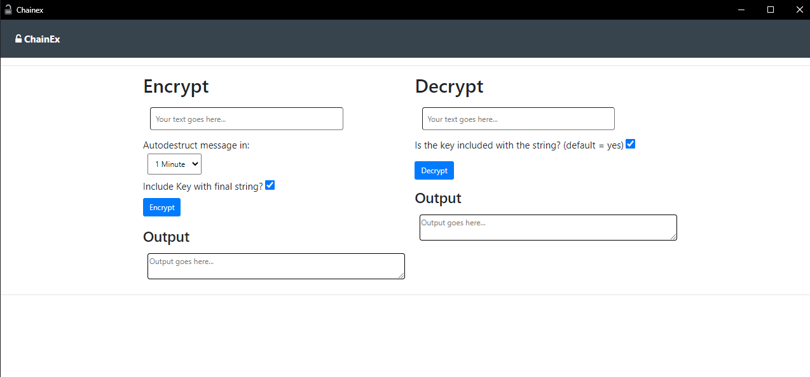
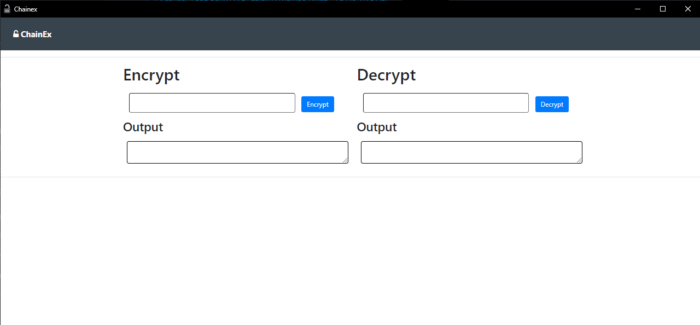

<h1 align="center">ChainEx</h1>

A tool to create temporary encrypted messages

	
	
	
	
	

# Install and screenshots
<a href="https://github.com/EncryptEx/chainex/releases/download/v3.1/chainex.exe">[v3.1] Portable Executable (.exe)</a> 
   
<a href="https://github.com/EncryptEx/chainex/releases/download/v2.3LTS/chainex.exe">[v2.3LTS] Portable Executable (.exe)</a> 
   
<a href="https://github.com/EncryptEx/chainex/releases/download/2.0/chainex.exe">[2.0] Portable Executable (.exe)</a> 
  
# ⭐ Stargazers  

# ⁉ FAQ
## 🌐 What can I do with ChainEx?
Tell your friends to download it too and start chatting with them with ChainEx encrypted messages.... But take into account that massges are available only the same that that were encrypted :D

## 🦠Why Chrome or my Antivirus says the .exe file is a virus?
Normally, viruses are coded with python, and all files coded with python are normally decteced as false virus by lots of internet antivirus and programs.  
<a href="https://answers.microsoft.com/en-us/protect/forum/protect_other-protect_scanning-protectwindows8_1/python-compiled-files-pyc-falsely-detected-as/7172e5b1-5c65-4d9c-811b-5ae08a4d52d2"> Here you have more information about it</a>

## 💻My friend is using a diferent version of the program. Is there any compatibility?
Yes, you can use 2.3 LTS version and 3.0 perfectly. the difference is that 2.3LTS users are always exporting the key into the encoded string. 

# ⁉ FAQ for Devs

## 🖥 The chainex.py file crashes when trying it to run?
You will need Google Chrome/Chromium installed to run the chainex.py since eel uses this browser by default.

Make sure that you have installed the correct [requirements.txt](requirements.txt)